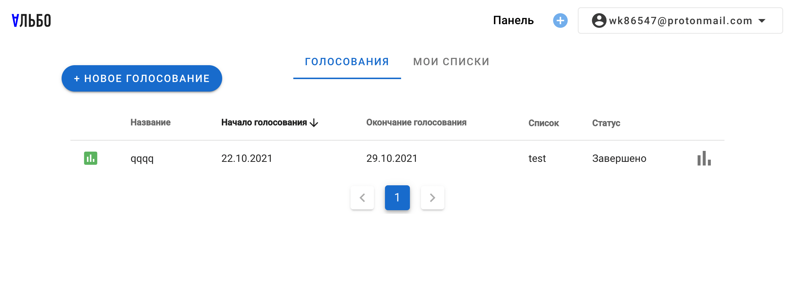
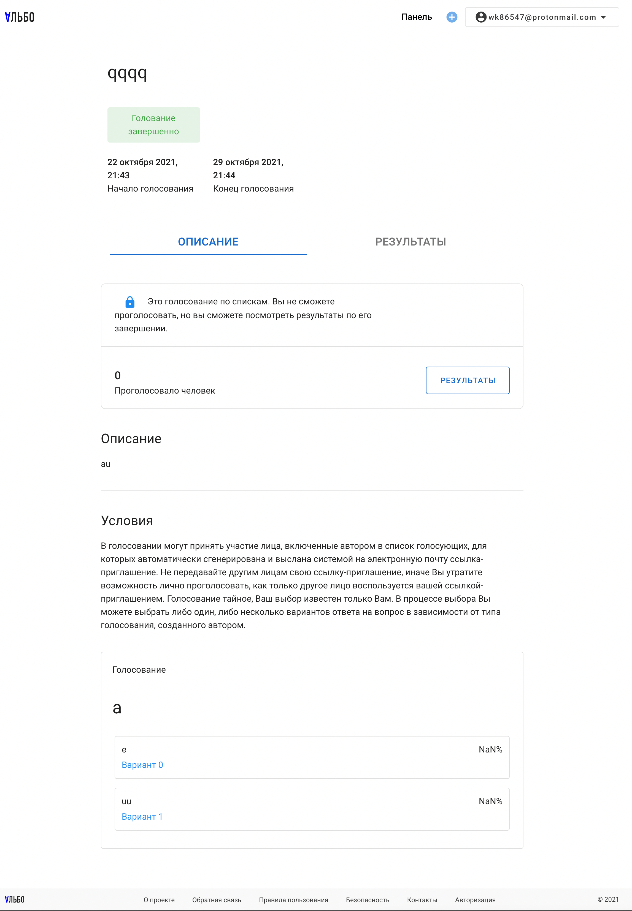
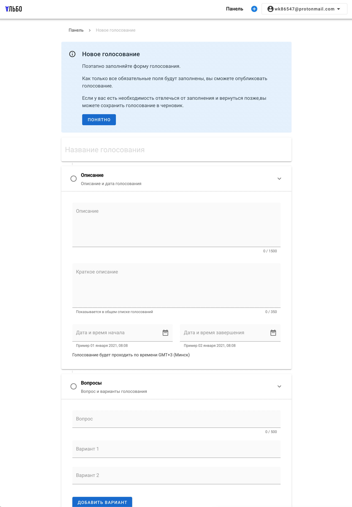
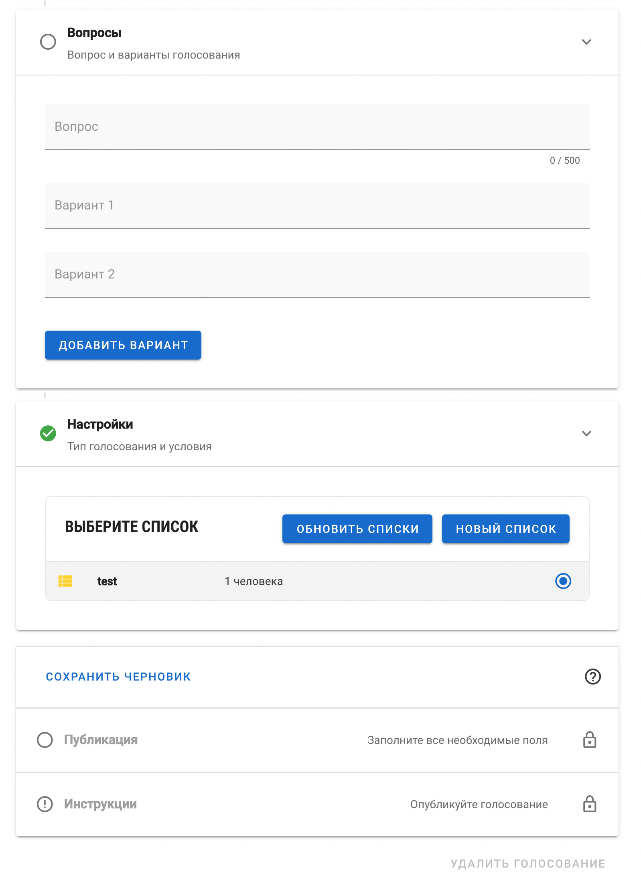

Albo - any authenticated user can create new election/poll. Poll results are available only for elections after they have ended:

Application does not collect or provide information on who voted, however every voter can verify their vote using unique secret token issued during vote.

When creating a new vote, start/end date can be specified and number of available answers are provided. This can be either people or decisions.

People you have in yoru list can be invited to take a vote. They will receive email invitation with unique voting token.

